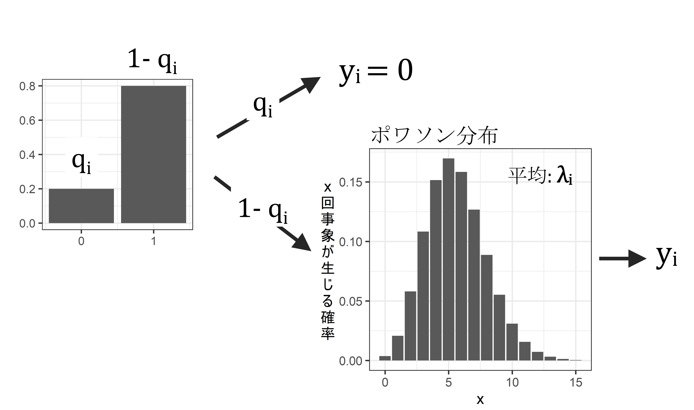

# ゼロ過剰ポワソンモデルとは  
以下では、応答変数がポワソン分布に従うと仮定したときにゼロ過剰が生じる場合について見ていく。  

## ポワソン回帰でゼロ過剰が生じる例  
例えば、森の中である一定距離歩いたときに見つかるニホンザルの数のデータを収集したところ、以下のデータ(`d_zipois`)が得られたとする。なお、`num_obs`は観察したサルの数を、`temp`はその日の気温を表す。  

シミュレーションによって架空のデータを作成する。  
```{r} 
## データの作成  

set.seed(1234)
N <- 200
temp <- rnorm(N, 10, 1.5)

p_zi <- exp((7 - 0.8*temp))/(1 + exp((7 - 0.8*temp)))

num_obs <- rep(0,N)

for(i in 1:N){
  num_obs[i] <- rbinom(1,1,1-p_zi[i])*rpois(1, lambda = exp(0.02 + 0.13*temp[i]))
}

dat_zipois <- data.frame(temp = temp,
           num_obs = num_obs)
```

作成されたデータがこちら。  
```{r}
dat_zipois
```
<br/>  

気温と観察されたサルの数の関係を調べたところ、以下のようになった。気温が高くなるほど、観察されるサルの数が多くなるように見える。
```{r, fig.dim = c(4.5,3.5)}
dat_zipois %>% 
  ggplot(aes(x = temp, y = num_obs))+
  geom_point(size = 3.5, alpha = 0.6)+
  theme_bw(base_size = 12)+
  theme(aspect.ratio=0.8)
```

そこで、以下のようなGLMを考え、気温が観察されるサルの数に与える影響を調べるとする。  

- 分布: ポワソン分布  
- リンク関数: log関数  
- 応答変数: 観察されたサルの数(`num_obs`)  
- 説明変数: 気温(`temp`)  


数式で表すと以下のようになる。ただし、$i$は各データポイントのIDを示す。例えば、$temp_i$は、$i$番目のデータの気温を表す。ただし、$i = 1,2,3,...,200$である。また、$num\_obs_i \sim Poisson(\lambda_i)$は、i番目のデータが平均$\lambda_i$のポワソン分布に従って得られるということである。  

$$
\begin{aligned}
log(\lambda_i) &= \beta_0 + \beta_1 \times temp_i\\
num\_obs_i &\sim Poisson(\lambda_i)
\end{aligned}
$$
 

RでのGLMのコードは以下のようになる。  
```{r}
r_pois <- glm(data = dat_zipois,
              num_obs ~ temp,
              family = poisson(link=log))
```

結果は以下のようになり、$\beta_0$の推定値は`r sprintf("%.3f",coef(r_pois)[[1]])`、$\beta_1$の推定値は`r sprintf("%.3f",coef(r_pois)[[2]])`である。  

```{r}
summary(r_pois)
```

つまり、観察されるサルの数は$\lambda = e^{-2.385 + 0.328 \times temp_i}$を平均とするポワソン分布から得られると推定された。  

そこで、推定したパラメータを持つモデルの下で得られるデータをシミュレートし(`num_obs_sim`)、それを実際に得られたデータと比較してみる。  


下の図からわかるように、実際に得られたデータ(`num_obs`)では、**推定されたモデルからシミュレートされたデータ**(`num_obs_sim`)**よりかなり0が多い**ことが分かる。このようなとき、**ゼロ過剰が生じている**という。    

```{r, fig.dim = c(7,4.5)}
## モデルの下で得られるデータをシミュレート  

num_obs_sim <- rpois(N,
                     lambda = exp(coef(r_pois)[[1]])+coef(r_pois)[[2]]*dat_zipois$temp)

## 実際のデータと比較  
data.frame(num_obs = num_obs,
           num_obs_sim = num_obs_sim) %>%
  pivot_longer(cols = 1:2) %>% 
  ggplot(aes(x = value))+
  geom_histogram(aes(fill = name),
                 position = "dodge", alpha = 0.8,
                 breaks = seq(0,15,1))+
  theme_bw(base_size = 13)+
  theme(aspect.ratio=0.8,
        axis.title.y = element_text(angle=0,vjust=0.5))+
  labs(x = "サルが観察された回数",
       y = "度\n数") -> p_pois_hist

p_pois_hist
```

実際のデータに含まれる0の数と、モデルが正しいと仮定したときにシミュレーションで生成したデータに含まれる0の数を比較することで、ゼロ過剰が生じているかを検定することができる(詳細は[こちら](https://cran.r-project.org/web/packages/DHARMa/vignettes/DHARMa.html#formal-tests-for-zero-inflation))。検定の結果、ゼロ過剰が検出された。  
```{r, fig.dim = c(4.5,4)}
testZeroInflation(r_pois)
```

Dispersion parameterを算出すると値が1を大きく超えており、過分散が生じていることが分かる。ゼロ過剰であることが原因だろう。  
```{r}
sum(residuals(r_pois,type = "pearson")^2)/r_pois$df.residual
```

過分散の検定をしても過分散が検出される。
```{r, fig.dim = c(4.5,4)}
resid_pois <-simulateResiduals(r_pois)

testDispersion(resid_pois)
```

Quantile residual(詳細は[こちら](https://cran.r-project.org/web/packages/DHARMa/vignettes/DHARMa.html#binomial-data))についてQQplotを描画しても、データがモデルで仮定された分布と合致していないことが分かる。  
```{r, fig.dim = c(4.5,4)}
plotQQunif(resid_pois)
```

このモデルの推定結果に基づく回帰曲線は以下のようになる。  
```{r, fig.dim = c(4.5,4)}
fit_pois <- ggpredict(r_pois,
          ## 温度は5~15で0.1刻み
          terms = "temp[5:15,by=0.1]",
          ## ここを変える
          type ="fixed")

ggplot(dat_zipois)+
  geom_point(aes(x = temp, y = num_obs),
             size = 3.5, alpha = 0.6)+
  ### 回帰曲線
  geom_line(data = fit_pois,
            aes(x=x, y = predicted))+
  ## 95%信頼区間
  geom_ribbon(data = fit_pois,
            aes(x=x, y = predicted,
                ymin = conf.low, ymax = conf.high),
            alpha = 0.5)+
   theme_bw(base_size = 18)+
  theme(aspect.ratio=0.8,
        plot.title = (element_text(size = 17)))+
  labs(title = "普通のポワソン回帰")-> p_pois

p_pois
```


## 対処法: ゼロ過剰ポワソンモデル  
こうしたゼロ過剰のデータに対する対処法の1つがゼロ過剰を仮定したモデル(**ゼロ過剰ポワソンモデル**)を用いることである。ゼロ過剰ポワソンモデルでは、以下のような2段階の過程で$i$番目のデータ($y_i$)が得られると仮定する。  

➀ 確率$q_i$でデータが必ず0になる。  
➁ $1-q_i$の確率で、データ$y_i$が平均$\lambda_i$のポワソン分布にしたがって得られる。  

つまり、**ゼロ過剰モデルは2種類のプロセスから得られた0が存在することを仮定**する。すなわち、ある確率$q_i$で必ず0が得られるとき(1)と、$1-q_i$の確率でデータがポワソン分布に従う場合に0が得られるとき(2)である。  

```{r, echo=FALSE, fig.dim = c(12,8), fig.cap="ゼロ過剰ポワソンモデルでデータが得られる過程"}


```


このようなプロセスで得られていると考えられるデータとしては、以下のような例が挙げられる。  

**例1. 各選手の盗塁成功数**    
盗塁数が0の選手の中には、そもそも盗塁しようとしない人と、盗塁しようとした結果失敗した人が含まれる。  

**例2. 動物のセンサスデータ**  
0のデータの中には、本当にセンサス中にその動物がいなかった場合と、動物がいたにもかかわらず観察者が何らかの要因(人間の観察能力の限界や観察環境など)によって見つけられなかった場合が含まれる。  以下にそのような場合が考えられる例を挙げる。  


ゼロ過剰ポワソンモデルにおいて、0が得られる確率は以下のようになる(1.2.2も参照)。 

$$
q_i + (1-q_i)\times\frac{\lambda_i^0}{0!} e^{-\lambda_i} \\
= q_i + (1-q_i)\times e^{-\lambda_i}
$$

0以外の値$y$が得られる確率は以下のようになる。  
$$
(1-q_i)\times \frac{\lambda^y}{y!}e^{-\lambda} \;\; (ただし、y>0)
$$


## ゼロ過剰ポワソンモデルの分析例  
それでは、先ほどのデータをゼロ過剰ポワソンモデルに当てはめよう。データが以下の式に従って得られると仮定する。このモデルでは、$q_i$も気温によって変化すると仮定する(気温によらないとモデリングすることもできる)。なお、$num\_obs_i \sim ZIPoisson(\lambda_i)$はサルの観察回数がゼロ過剰ポワソンモデルに従って得られることを示す。  
$$
\begin{aligned}
logit(q_i) &= log(\frac{q_i}{1-q_i}) = \beta_{10} + \beta_{11} \times temp_i\\
log(\lambda_i) &= \beta_{20} + \beta_{21}\times temp_i\\
num\_obs_i &\sim ZIPoisson(q_i, \lambda_i)
\end{aligned}
$$

Rでは`glmmTMB`パッケージを用いて以下のようにパラメータを推定できる。$q_i$が気温によらないと仮定する場合は、`ziformula ~ 1`とする。  

```{r}
r_zipois <- glmmTMB(data = dat_zipois,
                    num_obs ~ temp,
          ## 気温によらない場合は ziformula ~ 1
                    ziformula = ~temp,
                    family = "poisson")
```

モデルで推定されたパラメータは以下のようになる。

`Zero-inflation model:`というところにある推定結果が$q_i$に関するパラメータの推定値であり、$\beta_{10}$と$\beta_{11}$の推定値はそれぞれ`r sprintf("%.3f",glmmTMB::fixef(r_zipois)[[2]][[1]])`、`r sprintf("%.3f",glmmTMB::fixef(r_zipois)[[2]][[2]])`となる。  

`Conditional model:`というところにある推定結果が$\lambda_i$に関するパラメータの推定値であり、$\beta_{20}$と$\beta_{21}$の推定値はそれぞれ`r sprintf("%.3f",glmmTMB::fixef(r_zipois)[[1]][[1]])`、`r sprintf("%.3f",glmmTMB::fixef(r_zipois)[[1]][[2]])`となる。  

```{r}
summary(r_zipois)
```

推定したパラメータを持つゼロ過剰ポワソンモデルの下で得られるデータをシミュレートし(`num_obs_zisim`)、それを実際に得られたデータと比較してみる。  

```{r}
## 推定されたパラメータからデータをシミュレート
q <- 1/(1 +exp(-(fixef(r_zipois)[[2]][[1]] + fixef(r_zipois)[[2]][[2]]*dat_zipois$temp)))

lambda <- exp((fixef(r_zipois)[[1]][[1]] + fixef(r_zipois)[[1]][[2]]*dat_zipois$temp))

num_obs_zisim <- rbinom(N,1,1-q)*rpois(N, lambda)
```

下の図からわかるように、推定されたモデルからシミュレートされたデータ(`num_obs_zisim`)の分布は、実際のデータとかなりよくマッチしていることが分かる。   

```{r, fig.dim = c(7,4.5)}
## 実際のデータと比較  
data.frame(num_obs = dat_zipois$num_obs,
           num_obs_zisim = num_obs_zisim) %>%
  pivot_longer(cols = 1:2) %>% 
  ggplot(aes(x = value))+
  geom_histogram(aes(fill = name),
                 position = "dodge", alpha = 0.8,
                 breaks = seq(0,15,1))+
  theme_bw(base_size = 13)+
  theme(aspect.ratio=0.8,
        axis.title.y = element_text(angle=0,vjust=0.5))+
  labs(x = "サルが観察された回数",
       y = "度\n数") -> p_zipois_hist

p_zipois_hist
```

これは、普通のポワソンモデルの結果と比較すると明白である。なお、`num_obs_sim`は普通のポワソン分布を仮定したGLMで推定されたパラメータからシミュレートされたデータである。  

```{r, fig.dim = c(7,4.5)}
data.frame(num_obs = num_obs,
           num_obs_zisim = num_obs_zisim,
           num_obs_sim = num_obs_sim) %>%    pivot_longer(cols = 1:3) %>% 
  mutate(name = fct_relevel(name,"num_obs","num_obs_zisim")) %>% 
  ggplot(aes(x = value))+
  geom_histogram(aes(fill = name),
                 position = "dodge", alpha = 0.8,
                 breaks = seq(0,15,1))+
  theme_bw(base_size = 13)+
  theme(aspect.ratio=0.8,
        axis.title.y = element_text(angle=0,vjust=0.5))+
  labs(x = "サルが観察された回数",
       y = "度\n数") 
```

検定をしても、ゼロ過剰は検出されない。
```{r, fig.dim = c(4.5,4)}
testZeroInflation(r_zipois)
```

過分散も解消されたことが分かる。  
```{r, fig.dim = c(4.5,4)}
resid_zipois <-simulateResiduals(r_zipois)

testDispersion(resid_zipois)
```

QQplotをみても、データがモデルが仮定する分布によく合致している。  
```{r, fig.dim = c(4.5,4)}
plotQQunif(resid_zipois)
```

推定されたモデルに基づく回帰曲線を描画する。  
確率$q_i$で得られた0を含まないものと、含むものを両方描ける。詳細は[こちら](https://strengejacke.github.io/ggeffects/articles/introduction_randomeffects.html)。    

$q_i$で得られた0を**含まない**場合  
```{r}
fit_zipois_a <- ggpredict(r_zipois,
          ## 温度は5~15で0.1刻み
          terms = "temp[5:15,by=0.1]",
          type ="fixed")

ggplot(dat_zipois)+
  geom_point(aes(x = temp, y = num_obs),
             size = 3.5, alpha = 0.6)+
  ### 回帰曲線
  geom_line(data = fit_zipois_a,
            aes(x=x, y = predicted))+
  ## 95%信頼区間
  geom_ribbon(data = fit_zipois_a,
            aes(x=x, y = predicted,
                ymin = conf.low, ymax = conf.high),
            alpha = 0.5)+
   theme_bw(base_size = 18)+
  theme(aspect.ratio=0.8,
        plot.title=element_text(size = 17))+
  labs(title = "ゼロ過剰ポワソンモデル\n(qによる0含まず)")-> p_zipois_a
```

$q_i$で得られた0を**含む**場合  
```{r}
fit_zipois_b <- ggpredict(r_zipois,
          ## 温度は5~15で0.1刻み
          terms = "temp[5:15,by=0.1]",
          ## ここを変える
          type ="zero_inflated")

ggplot(dat_zipois)+
  geom_point(aes(x = temp, y = num_obs),
             size = 3.5, alpha = 0.6)+
  ### 回帰曲線
  geom_line(data = fit_zipois_b,
            aes(x=x, y = predicted))+
  ## 95%信頼区間
  geom_ribbon(data = fit_zipois_b,
            aes(x=x, y = predicted,
                ymin = conf.low, ymax = conf.high),
            alpha = 0.5)+
   theme_bw(base_size = 18)+
  theme(aspect.ratio=0.8,
        plot.title=element_text(size = 17))+
  labs(title = "ゼロ過剰ポワソンモデル\n(qによる0含む)") -> p_zipois_b
```

比較のため、普通のポワソン回帰による回帰曲線も併置する。  
```{r, fig.dim = c(13,13)}
library(patchwork)

p_pois + p_zipois_a + p_zipois_b + plot_layout(ncol = 2)
```
