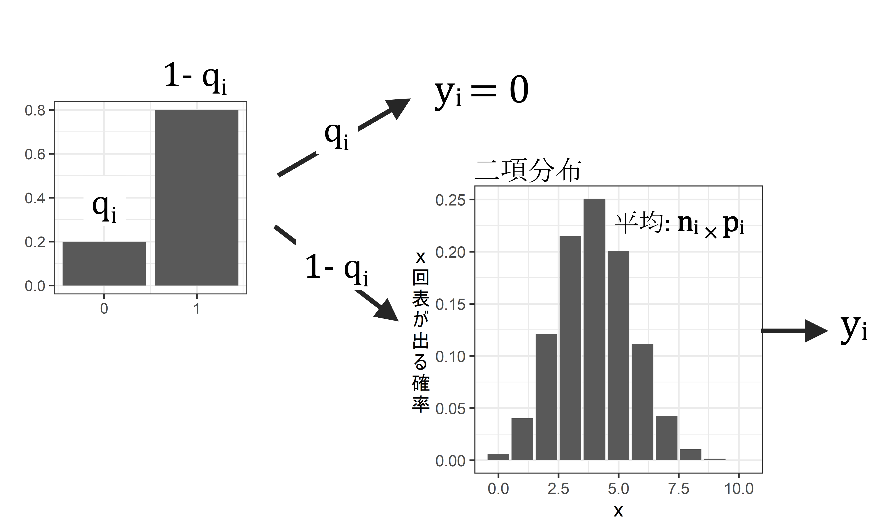

# ゼロ過剰二項モデルとは  
以下では、同様に応答変数が二項分布に従うと仮定したときにゼロ過剰が生じる場合について見ていく。  

## ロジスティック回帰でゼロ過剰が生じる例  
ニホンザルのメスが群れ外オスから攻撃された直後に怪我が確認されるか否かを調べた結果、以下のデータ(`dat_zibinom`)が得られたとする。なお、`sum`は攻撃された回数を、`num_inj`は攻撃の直後に怪我が確認された回数を、`age`はメスの年齢を表す。        

シミュレーションによって架空のデータを作成する。  
```{r}
set.seed(1234)
N <- 200
age <- rnorm(N, 15, 3.5)
sum <- rpois(N,100)

p <- exp((0.8 - 0.08*age))/(1 + exp((0.8 - 0.08*age)))

num_inj <- rep(0,N)

for(i in 1:N){
  num_inj[i] <- rbinom(1,1,1-p[i])*rbinom(1, sum[i], exp(-5.5 + 0.12*age[i])/(1 + exp(-5.5 + 0.12*age[i])))
}

dat_zibinom <- data.frame(age = age,
           num_inj = num_inj,
           sum = sum)
```

作成されたデータがこちら。  
```{r}
dat_zibinom %>% 
  datatable()
```
<br/>  

サルの年齢(`age`)と攻撃の直後に怪我が確認された割合(`num_inj`/`sum`)をプロットしたところ、以下のようになった。年齢が高くなるほど、怪我が確認された割合が多くなるように見える。  

```{r, fig.dim = c(4.5,3.5)}
dat_zibinom %>% 
  ggplot(aes(x = age, y = num_inj/sum))+
  geom_point(size = 3.5, alpha = 0.6)+
  theme_bw(base_size = 12)+
  theme(aspect.ratio= 0.8,
        axis.title.y = element_text(angle=0,
                                    vjust=0.5,
                                    size = 10))+
  coord_cartesian(ylim = c(0,0.122))+
  scale_y_continuous(breaks = seq(0,0.15,0.02))+
  labs(y = "怪\n我\nが\n確\n認\nさ\nれ\nた\n割\n合")
```

そこで、以下のようなGLMを考え、年齢が怪我が確認された割合に影響するかを調べる。  

- 分布: 二項分布  
- リンク関数: logit関数  
- 応答変数: 怪我が確認された割合(`num_inj`/`sum`)  
- 説明変数: 年齢(`age`)  


数式で表すと以下のようになる。ただし、$i$は各データポイントのIDを示す。例えば、$age_i$は、$i$番目の個体の年齢を表す。ただし、$i = 1,2,3,...,200$である。      

なお、$num\_inj_i \sim Binomial(sum_i,p_i)$は、i番目の個体に怪我が確認された回数が試行数$sum_i$、確率($p_i$)の二項分布に従って得られるということを示す。  

$$
\begin{aligned}
logit(p_i) &= log(\frac{p_i}{1-p_i}) = \beta_0 + \beta_{2} \times age_i\\
num\_inj_i &\sim Binomial(trials_i, p_i)
\end{aligned}
$$
 

RでのGLMのコードは以下のようになる。  
```{r}
r_binom <- glm(data = dat_zibinom,
              cbind(num_inj, sum-num_inj) ~ age,
              family = binomial(link=logit))
```

結果は以下のようになり、$\beta_0$の推定値は`r sprintf("%.3f",coef(r_binom)[[1]])`、$\beta_1$の推定値は`r sprintf("%.3f",coef(r_binom)[[2]])`である。  

```{r}
summary(r_binom)
```

つまり、怪我が確認される回数は試行数$sum_i$、$p_i = \frac{1}{1 + -e^{-6,045 + 0.128 \times age_i}}$となる二項分布から得られると推定される($log(\frac{p_i}{1-p_i}) = \beta_0 + \beta_{2} \times age_i$より)。  

そこで、推定したパラメータを持つモデルの下で得られるデータをシミュレートし(`num_inj_sim`)、それを実際に得られたデータと比較してみる。  

下の図からわかるように、実際に得られたデータから算出された怪我が観察された割合(`prop_inj`)では、**推定されたモデルからシミュレートされたデータ**(`prop_inj_sim`)**より0が多い**(= ゼロ過剰が生じている)。<u>怪我がをしていても体毛に隠れていて気づかない場合があったなど、0が増えてしまう何らかのメカニズムがあったと推測される</u>。    

```{r, fig.dim = c(7,4.5)}
## モデルの下で得られるデータをシミュレート  
p <- 1/(1 +exp(-(coef(r_binom)[[1]] + coef(r_binom)[[2]]*dat_zibinom$age)))

num_inj_sim <- rbinom(N, dat_zibinom$sum, p)
prop_inj_sim <- num_inj_sim/dat_zibinom$sum

## 実際のデータと比較  
data.frame(prop_inj = num_inj/dat_zibinom$sum,
           prop_inj_sim = prop_inj_sim) %>%
  pivot_longer(cols = 1:2) %>% 
  ggplot(aes(x = value))+
  geom_histogram(aes(fill = name),
                 position = "dodge", alpha = 0.8,
                 breaks = seq(0,0.2,by=0.01))+
  theme_bw(base_size = 13)+
  theme(aspect.ratio=0.8,
        axis.title.y = element_text(angle=0,vjust=0.5))+
  labs(x = "怪我が確認された割合",
       y = "度\n数")+
  coord_cartesian(xlim = c(0,0.13))-> p_binom_hist

p_binom_hist
```

検定をすると、ゼロ過剰が検出される。
```{r, fig.dim = c(4.5,4)}
testZeroInflation(r_binom)
```

dispersion parameterを算出すると、二項分布での規定値(= 1)を越えており、過分散が生じていることが分かる。おそらくゼロ過剰が原因だろう。      
```{r}
sum(residuals(r_binom,type = "pearson")^2)/r_binom$df.residual
```

検定を行っても過分散が検出された。
```{r, fig.dim = c(4.5,4)}
resid_binom <-simulateResiduals(r_binom)

testDispersion(resid_binom)
```

QQplotをみても、データがモデルによく当てはまっていないことが分かる。  
```{r, fig.dim = c(4.5,4)}
plotQQunif(resid_binom)
```

このモデルの推定結果に基づく回帰曲線は以下のようになる。  
```{r, fig.dim = c(4.5,4)}
fit_binom <- ggpredict(r_binom,
          ## 温度は5~15で0.1刻み
          terms = "age[5:26,by=0.1]",
          ## ここを変える
          type ="fixed")

ggplot(dat_zibinom)+
  geom_point(aes(x = age, y = num_inj/sum),
             size = 3.5, alpha = 0.6)+
  ### 回帰曲線
  geom_line(data = fit_binom,
            aes(x=x, y = predicted))+
  ## 95%信頼区間
  geom_ribbon(data = fit_binom,
            aes(x=x, y = predicted,
                ymin = conf.low, ymax = conf.high),
            alpha = 0.5)+
   theme_bw(base_size = 18)+
  theme(aspect.ratio= 0.8,
        axis.title.y = element_text(angle=0,
                                    vjust=0.5,
                                    size =10),
        plot.title=element_text(size = 17))+
  coord_cartesian(ylim = c(0,0.122))+
  scale_y_continuous(breaks = seq(0,0.15,0.02))+
  labs(title = "普通の二項分布モデル",
       y = "怪\n我\nが\n確\n認\nさ\nれ\nた\n割\n合")-> p_binom

p_binom
```

## 対処法: ゼロ過剰二項モデル  
こうしたゼロ過剰のデータに対する対処法の1つが、ポワソン分布の場合と同様に、ゼロ過剰を仮定したモデル(**ゼロ過剰二項モデル**)を用いることである。ゼロ過剰二項モデルでも、ゼロ過剰ポワソンモデルのように2段階の過程で$i$番目のデータ($y_i$)が得られると仮定する。  

➀ 確率$q_i$でデータが必ず0になる。  
➁ $1-q_i$の確率で、データ$y_i$が確率$p_i$、試行数$n_i$の二項分布に従って得られる。  

すなわち、**ゼロ過剰モデルは2種類のプロセスから得られた0が存在することを仮定**する。すなわち、ある確率$q_i$で必ず0が得られるとき(1)と、$1-q_i$の確率でデータが二項分布に従う場合に0が得られるとき(2)である。  

```{r, echo=FALSE, fig.dim = c(12,8), fig.cap="ゼロ過剰二項モデルでデータが得られる過程"}


```


ゼロ過剰二項分布において、0が得られる確率は以下のようになる。  

$$
q_i + (1-q_i)\times _n C _0 p_i^0(1-p_i)^{n_i-0} \\
= q_i + (1-q_i)\times (1-p_i)^{n_i}
$$

一方で、0以外が得られる確率は以下のようになる。  
$$
(1-q_i)\times _n C _0 p_i^x(1-p_i)^{n_i-x} \; (x>0)
$$

## ゼロ過剰二項モデルの分析例1(GLMの場合)    
それでは、先ほどのデータをゼロ過剰二項モデルに当てはめよう。データが以下の式に従って得られると仮定する。モデルでは、$q_i$も年齢によって変化すると仮定する(年齢によらないと仮定することもできる)。なお、$num\_inj_i \sim ZIBinomial(p_i)$は怪我が確認された回数がゼロ過剰二項モデルに従って得られることを示す。  

$$
\begin{aligned}
logit(q_i) &= log(\frac{q_i}{1-q_i}) = \beta_{10} + \beta_{11} \times age_i\\
logit(p_i) &= log(\frac{p_i}{1-p_i}) = \beta_{20} + \beta_{21} \times age_i\\
num\_inj_i &\sim ZIBinomial(q_i, trials_i, p_i)
\end{aligned}
$$

Rでは`glmmTMB`パッケージを用いて以下のようにパラメータを推定できる。$q_i$が年齢によらないと仮定する場合は、`ziformula ~ 1`とする。    

```{r}
r_zibinom <- glmmTMB(data = dat_zibinom,
                    cbind(num_inj, sum - num_inj) ~ age,
        ## 年齢によらないとする場合はziformula~1
                    ziformula = ~age,
                    family = "binomial")
```

モデルで推定されたパラメータは以下のようになる。

`Zero-inflation model:`というところにある推定結果が$q_i$に関するパラメータの推定値であり、$\beta_{10}$と$\beta_{11}$の推定値はそれぞれ`r sprintf("%.3f",glmmTMB::fixef(r_zibinom)[[2]][[1]])`、`r sprintf("%.3f",glmmTMB::fixef(r_zibinom)[[2]][[2]])`となる。  

`Conditional model:`というところにある推定結果が$p_i$に関するパラメータの推定値であり、$\beta_{20}$と$\beta_{21}$の推定値はそれぞれ`r sprintf("%.3f",glmmTMB::fixef(r_zibinom)[[1]][[1]])`、`r sprintf("%.3f",glmmTMB::fixef(r_zibinom)[[1]][[2]])`となる。  

```{r}
summary(r_zibinom)
```

推定されたたパラメータを持つゼロ過剰二項モデルの下で得られるデータをシミュレートし(`num_inj_zisim`)、それを実際に得られたデータと比較してみる。  

```{r}
## 推定されたパラメータからデータをシミュレート
q <- 1/(1 +exp(-(fixef(r_zibinom)[[2]][[1]] + fixef(r_zibinom)[[2]][[2]]*dat_zibinom$age)))

p <- 1/(1 +exp(-(fixef(r_zibinom)[[1]][[1]] + fixef(r_zibinom)[[1]][[2]]*dat_zibinom$age)))

num_inj_zisim <- rbinom(N,1,1-q)*rbinom(N,dat_zibinom$sum, p)

prop_inj_zisim <- num_inj_zisim/dat_zibinom$sum
```

下の図からわかるように、ゼロ過剰二項モデルからシミュレートされたデータから算出した怪我が観察された割合(`prop_inj_zisim`)の分布は、さきほどよりも実際のデータにマッチしていることが分かる。   

```{r, fig.dim = c(7,4.5)}
## 実際のデータと比較  
  data.frame(prop_inj = dat_zibinom$num_inj/dat_zibinom$sum,
           prop_inj_zisim = prop_inj_zisim) %>%
  pivot_longer(cols = 1:2) %>% 
  ggplot(aes(x = value))+
  geom_histogram(aes(fill = name),
                 position = "dodge", alpha = 0.8,
                 breaks = seq(0,0.13,0.01))+
  theme_bw(base_size = 13)+
  theme(aspect.ratio=0.8,
        axis.title.y = element_text(angle=0,vjust=0.5))+
  labs(x = "怪我が確認された割合",
       y = "度\n数") -> p_zibinom_hist

p_zibinom_hist
```

これは、普通の二項分布モデルの結果(`prop_inj_sim`)と比較すると明白である。

```{r, fig.dim = c(7,4.5)}
data.frame(prop_inj = dat_zibinom$num_inj/dat_zibinom$sum,
           prop_inj_zisim = prop_inj_zisim,
           prop_inj_sim = prop_inj_sim) %>%    pivot_longer(cols = 1:3) %>% 
  mutate(name = fct_relevel(name,"prop_inj","prop_inj_zisim")) %>% 
  ggplot(aes(x = value))+
  geom_histogram(aes(fill = name),
                 position = "dodge", alpha = 0.8,
                 breaks = seq(0,0.13,0.01))+
  theme_bw(base_size = 13)+
  theme(aspect.ratio=0.8,
        axis.title.y = element_text(angle=0,vjust=0.5))+
  labs(x = "怪我が確認された割合",
       y = "度\n数") 
```

検定をしても、ゼロ過剰は検出されない。
```{r, fig.dim = c(4.5,4)}
testZeroInflation(r_zibinom)
```

検定を行っても過分散は検出されない。
```{r, fig.dim = c(4.5,4)}
resid_zibinom <-simulateResiduals(r_zibinom)

testDispersion(resid_zibinom)
```

QQplotをみても、データがモデルによく当てはまっていることが分かる。  
```{r, fig.dim = c(4.5,4)}
plotQQunif(resid_zibinom)
```

推定されたモデルに基づく回帰曲線を描画する。  
確率$q_i$で得られた0を含まないものと、含むものを両方描ける。  

$q_i$で得られた0を**含まない**場合  
```{r}
fit_zibinom_a <- ggpredict(r_zibinom,
          ## 温度は5~15で0.1刻み
          terms = "age[5:26,by=0.1]",
          type ="fixed")

ggplot(dat_zibinom)+
  geom_point(aes(x = age, y = num_inj/sum),
             size = 3.5, alpha = 0.6)+
  ### 回帰曲線
  geom_line(data = fit_zibinom_a,
            aes(x=x, y = predicted))+
  ## 95%信頼区間
  geom_ribbon(data = fit_zibinom_a,
            aes(x=x, y = predicted,
                ymin = conf.low, ymax = conf.high),
            alpha = 0.5)+
   theme_bw(base_size = 18)+
  theme(aspect.ratio= 0.8,
        axis.title.y = element_text(angle=0,
                                    vjust=0.5,
                                    size = 10),
        plot.title=element_text(size = 17))+
  coord_cartesian(ylim = c(0,0.122))+
  scale_y_continuous(breaks = seq(0,0.15,0.02))+
  labs(title = "ゼロ過剰二項モデル\n(qによる0含まず)",
       y = "怪\n我\nが\n確\n認\nさ\nれ\nた\n割\n合")-> p_zibinom_a
```

$q_i$で得られた0を**含む**場合  
```{r}
fit_zibinom_b <- ggpredict(r_zibinom,
          ## 温度は5~15で0.1刻み
          terms = "age[5:26,by=0.1]",
          type ="zero_inflated")

ggplot(dat_zibinom)+
  geom_point(aes(x = age, y = num_inj/sum),
             size = 3.5, alpha = 0.6)+
  ### 回帰曲線
  geom_line(data = fit_zibinom_b,
            aes(x=x, y = predicted))+
  ## 95%信頼区間
  geom_ribbon(data = fit_zibinom_b,
            aes(x=x, y = predicted,
                ymin = conf.low, ymax = conf.high),
            alpha = 0.5)+
   theme_bw(base_size = 18)+
  theme(aspect.ratio= 0.8,
        axis.title.y = element_text(angle=0,
                                    vjust=0.5,
                                    size =10),
        plot.title=element_text(size = 17))+
  coord_cartesian(ylim = c(0,0.122))+
  scale_y_continuous(breaks = seq(0,0.15,0.02))+
  labs(title = "ゼロ過剰二項モデル\n(qによる0含む)",
       y = "怪\n我\nが\n確\n認\nさ\nれ\nた\n割\n合")-> p_zibinom_b
```

比較のため、普通のポワソン回帰による回帰曲線も併置する。  
```{r, fig.dim = c(13,13)}
library(patchwork)

p_binom + p_zibinom_a + p_zibinom_b + plot_layout(ncol = 2)
```

## ゼロ過剰二項モデルの分析例2(GLMMの場合)  
ゼロ過剰モデルはランダム効果が含まれる一般化線形モデル(GLMM)についても適用できる。先ほどと同様に
ニホンザルのメスが群れ外オスから攻撃された直後に怪我が確認されるか否かを調べたとする。今度は先ほどとは異なり5年分のデータがある、すなわち同じメスについて5つのデータポイントがあるとする(`dat_zibinomglmm`)。なお、`femaleID`はメスのIDを、`sum`は攻撃された回数を、`num_inj`は攻撃の直後に怪我が確認された回数を、`age`はメスの年齢を表す。        
シミュレーションによって架空のデータを作成する。  
```{r}
## データの作成

set.seed(1234)

N <- 1000
femaleID <- rep(seq(1,N/5,by=1),each=5)
age <- rep(rnorm(N/5, 15, 3.5), each = 5)
sum <- rep(rpois(N/5,100), each = 5)

p <- exp((0.8 - 0.08*age))/(1 + exp((0.8 - 0.08*age)))

r <- rep(rnorm(200, mean = 0, sd = 0.8),each=5)

num_inj <- rep(0,N)

for(i in 1:N){
  num_inj[i] <- rbinom(1,1,1-p[i])*rbinom(1, sum[i], exp(-5.7 + 0.15*age[i] + r[i])/(1 + exp(-5.7 + 0.15*age[i] + r[i])))
}

dat_zibinom_glmm <- data.frame(femaleID = as.factor(femaleID),
                          age = age,
           num_inj = num_inj,
           sum = sum)
```

作成されたデータがこちら。  
```{r}
dat_zibinom_glmm %>% 
  datatable()
```
<br/>  

サルの年齢(`age`)と攻撃の直後に怪我が確認された割合(`num_inj`/`sum`)をプロットしたところ、以下のようになった。年齢が高くなるほど、怪我が確認された割合が多くなるように見える。  

```{r, fig.dim = c(4.5,3.5)}
dat_zibinom_glmm %>% 
  ggplot(aes(x = age, y = num_inj/sum))+
  geom_point(size = 3.5, alpha = 0.6)+
  theme_bw(base_size = 12)+
  theme(aspect.ratio= 0.8,
        axis.title.y = element_text(angle=0,
                                    vjust=0.5,
                                    size = 10))+
  coord_cartesian(ylim = c(0,0.35))+
  scale_y_continuous(breaks = seq(0,0.35,0.05))+
  labs(y = "怪\n我\nが\n確\n認\nさ\nれ\nた\n割\n合")
```

### 普通のGLMMを適用する  
そこで、以下のようなGLMMを考え、年齢が怪我が確認された割合に影響するかを調べる。  

- 分布: 二項分布  
- リンク関数: logit関数  
- 応答変数: 怪我が確認された割合(`num_inj`/`sum`)  
- 説明変数: 年齢(`age`)  
- ランダム切片: メスID


数式で表すと以下のようになる。ただし、$i$は各データポイントのIDを示す。例えば、$age_i$は、$i$番目の個体の年齢を表す。ただし、$i = 1,2,3,...,1000$である。     

なお、$r_j \sim Normal(0, \sigma_j)$は$r_{femaleID_i}$が平均0、分散$\sigma^2$の正規分布に従って得られることを示す。  

$$
\begin{aligned}
r_{femaleID_i} &\sim Normal(0, \sigma^2) \\
logit(p_i) &= log(\frac{p_i}{1-p_i}) = \beta_0 + \beta_{1} \times age_i + r_{femaleID_i}\\
num\_inj_i &\sim Binomial(trials_i, p_i)
\end{aligned}
$$

Rでは以下のように実行する。  
```{r}
r_binom_glmm <- glmer(data = dat_zibinom_glmm,
              cbind(num_inj, sum-num_inj) ~ age + (1|femaleID),
              family = binomial(link="logit"))
```

結果は以下のようになり、$\beta_0$の推定値は`r sprintf("%.3f",glmmTMB::fixef(r_binom_glmm)[[1]])`、$\beta_1$の推定値は`r sprintf("%.3f",glmmTMB::fixef(r_binom_glmm)[[2]])`、$\sigma$の推定値は`r sprintf("%.3f",data.frame(glmmTMB::VarCorr(r_binom_glmm))$sdcor)`である。  

```{r}
summary(r_binom_glmm)
```

つまり、$r_{femaleID_i}$は平均0、標準偏差0.888の正規分布から得られ、怪我が確認される回数は試行数10、$\frac{p_i}{1-p_i} = e^{-7.40 + 0.216 \times age_i + r_{femaleID_i}}$となる二項分布から得られると推定される。  

そこで、推定したパラメータを持つモデルの下で得られるデータをシミュレートし(`num_inj_sim_glmm`)、それを実際に得られたデータと比較してみる。  

下の図からわかるように、実際に得られたデータから算出された怪我が観察された割合(`prop_inj`)では、**推定されたモデルからシミュレートされたデータ**(`prop_inj_sim_glmm`)**より0が多い**(= ゼロ過剰が生じている)。GLMの場合と同様に<u>怪我がをしていても体毛に隠れていて気づかない場合があったなど、0が増えてしまう何らかのメカニズムがあったと推測される</u>。    

```{r, fig.dim = c(7.5,4.5)}
## モデルの下で得られるデータをシミュレート  
p <- 1/(1 +exp(-(fixef(r_binom_glmm)[[1]] + fixef(r_binom_glmm)[[2]]*dat_zibinom_glmm$age + rep(ranef(r_binom_glmm)$femaleID$`(Intercept)`,each = 5))))

num_inj_sim_glmm <- rbinom(N, dat_zibinom_glmm$sum, p)
prop_inj_sim_glmm <- num_inj_sim_glmm/dat_zibinom_glmm$sum

## 実際のデータと比較  
data.frame(prop_inj = num_inj/dat_zibinom_glmm$sum,
           prop_inj_sim_glmm = prop_inj_sim_glmm) %>%
  pivot_longer(cols = 1:2) %>% 
  ggplot(aes(x = value))+
  geom_histogram(aes(fill = name),
                 position = "dodge", alpha = 0.8,
                 breaks = seq(0,0.2,by=0.01))+
  theme_bw(base_size = 13)+
  theme(aspect.ratio=0.8,
        axis.title.y = element_text(angle=0,vjust=0.5))+
  labs(x = "怪我が確認された割合",
       y = "度\n数")+
  coord_cartesian(xlim = c(0,0.13))-> p_binom_hist

p_binom_hist
```

検定をすると、ゼロ過剰が検出される。
```{r, fig.dim = c(4.5,4)}
testZeroInflation(r_binom_glmm)
```

dispersion parameterを算出すると、二項分布での規定値(= 1)を越えており、過分散が生じていることが分かる。おそらくゼロ過剰が原因だろう。      
```{r}
resid_binom_glmm <-simulateResiduals(r_binom_glmm)

check_overdispersion(r_binom_glmm)
```

QQplotをみても、データがモデルによく当てはまっていないことが分かる。  
```{r, fig.dim = c(4.5,4)}
plotQQunif(resid_binom_glmm)
```


### ゼロ過剰二項モデル  
そこで、ゼロ過剰モデルを考える。  
数式で表すと以下のようになる。ただし、$i$は各データポイントのIDを示す。例えば、$age_i$は、$i$番目の個体の年齢を表す。ただし、$i = 1,2,3,...,1000$である。  

なお、今回は$q_i$は年齢によって変化するが、メスのIDによるばらつきはないとする(メスIDによるばらつきを仮定することもできる)。       

$$
\begin{aligned}
r_{femaleID_i} &\sim Normal(0, \sigma^2) \\
logit(q_i) &= log(\frac{q_i}{1-q_i}) = \beta_{10} + \beta_{11} \times age_i\\
logit(p_i) &= log(\frac{p_i}{1-p_i}) = \beta_{20} + \beta_{21} \times age_i + r_{femaleID_i}\\
num\_inj_i &\sim ZIBinomial(q_i, trials_i, p_i)
\end{aligned}
$$

Rでは以下のコードで実行できる。  
```{r}
r_zibinom_glmm <- glmmTMB(data = dat_zibinom_glmm,
  cbind(num_inj, sum - num_inj) ~ age + (1|femaleID),
  ## 年齢によらないとする場合はziformula~1,
  ## メスIDによるばらつきを仮定する場合はziformula ~ age + (1|femaleID)
                    ziformula = ~age,
                    family = "binomial")
```

モデルで推定されたパラメータは以下のようになる。

`Zero-inflation model:`というところにある推定結果が$q_i$に関するパラメータの推定値であり、$\beta_{10}$と$\beta_{11}$の推定値はそれぞれ`r sprintf("%.3f",glmmTMB::fixef(r_zibinom_glmm)[[2]][[1]])`、`r sprintf("%.3f",glmmTMB::fixef(r_zibinom_glmm)[[2]][[2]])`となる。  

`Conditional model:`というところにある推定結果が$p_i$に関するパラメータの推定値であり、$\beta_{20}$と$\beta_{21}$の推定値はそれぞれ`r sprintf("%.3f",glmmTMB::fixef(r_zibinom_glmm)[[1]][[1]])`、`r sprintf("%.3f",glmmTMB::fixef(r_zibinom_glmm)[[1]][[2]])`となる。  

```{r}
summary(r_zibinom_glmm)
```

推定したパラメータを持つゼロ過剰二項モデルの下で得られるデータをシミュレートし(`num_inj_zisim_glmm`)、それを実際に得られたデータと比較してみる。  

```{r}
## 推定されたパラメータからデータをシミュレート
q <- 1/(1 +exp(-(fixef(r_zibinom_glmm)[[2]][[1]] + fixef(r_zibinom_glmm)[[2]][[2]]*dat_zibinom_glmm$age)))

p <- 1/(1 +exp(-(fixef(r_zibinom_glmm)[[1]][[1]] + fixef(r_zibinom_glmm)[[1]][[2]]*dat_zibinom_glmm$age +  rep(as.vector(ranef(r_binom_glmm))$femaleID$`(Intercept)`,5))))

num_inj_zisim_glmm <- rbinom(N,1,1-q)*rbinom(N,dat_zibinom_glmm$sum, p)

prop_inj_zisim_glmm <- num_inj_zisim_glmm/dat_zibinom_glmm$sum
```

下の図からわかるように、推定されたモデルからシミュレートされたデータから算出した怪我が観察された割合(`prop_inj_zisim_glmm`)の分布は、さきほどより実際のデータとよくマッチしていることが分かる。   

```{r, fig.dim = c(7,4.5)}
## 実際のデータと比較  
  data.frame(prop_inj = dat_zibinom_glmm$num_inj/dat_zibinom_glmm$sum,
           prop_inj_zisim_glmm = prop_inj_zisim_glmm) %>%
  pivot_longer(cols = 1:2) %>% 
  ggplot(aes(x = value))+
  geom_histogram(aes(fill = name),
                 position = "dodge", alpha = 0.8,
                 breaks = seq(0,0.13,0.01))+
  theme_bw(base_size = 13)+
  theme(aspect.ratio=0.8,
        axis.title.y = element_text(angle=0,vjust=0.5))+
  labs(x = "怪我が確認された割合",
       y = "度\n数") -> p_zibinom_glmm_hist

p_zibinom_glmm_hist
```

検定をしても、ゼロ過剰は検出されない。
```{r, fig.dim = c(4.5,4)}
testZeroInflation(r_zibinom_glmm)
```

検定を行っても過分散が検出されない。
```{r, fig.dim = c(4.5,4)}
resid_zibinom_glmm <-simulateResiduals(r_zibinom_glmm)

testDispersion(resid_zibinom_glmm)
```

QQplotをみても、データがモデルによく当てはまっていることが分かる。  
```{r, fig.dim = c(4.5,4)}
plotQQunif(resid_zibinom_glmm)
```

推定されたモデルに基づく回帰曲線を描画する。  
確率$q_i$で得られた0を含まないものと、含むものを両方描ける。  

$q_i$で得られた0を**含まない**場合  
```{r}
fit_zibinom_glmm_a <- ggpredict(r_zibinom_glmm,
          ## 温度は5~26で0.1刻み
          terms = "age[5:26,by=0.1]",
          type ="fixed")

ggplot(dat_zibinom_glmm)+
  geom_point(aes(x = age, y = num_inj/sum),
             size = 3.5, alpha = 0.6)+
  ### 回帰曲線
  geom_line(data = fit_zibinom_glmm_a,
            aes(x=x, y = predicted))+
  ## 95%信頼区間
  geom_ribbon(data = fit_zibinom_glmm_a,
            aes(x=x, y = predicted,
                ymin = conf.low, ymax = conf.high),
            alpha = 0.5)+
   theme_bw(base_size = 18)+
  theme(aspect.ratio= 0.8,
        axis.title.y = element_text(angle=0,
                                    vjust=0.5,
                                    size = 10),
        plot.title=element_text(size = 17))+
  coord_cartesian(ylim = c(0,0.35))+
  scale_y_continuous(breaks = seq(0,0.35,0.05))+
  labs(title = "ゼロ過剰二項モデル\n(qによる0含まず)",
       y = "怪\n我\nが\n確\n認\nさ\nれ\nた\n割\n合")-> p_zibinom_glmm_a
```

$q_i$で得られた0を**含む**場合  
```{r}
fit_zibinom_glmm_b <- ggpredict(r_zibinom_glmm,
          ## 温度は5~15で0.1刻み
          terms = "age[5:26,by=0.1]",
          type ="zero_inflated")

ggplot(dat_zibinom_glmm)+
  geom_point(aes(x = age, y = num_inj/sum),
             size = 3.5, alpha = 0.6)+
  ### 回帰曲線
  geom_line(data = fit_zibinom_glmm_b,
            aes(x=x, y = predicted))+
  ## 95%信頼区間
  geom_ribbon(data = fit_zibinom_glmm_b,
            aes(x=x, y = predicted,
                ymin = conf.low, ymax = conf.high),
            alpha = 0.5)+
   theme_bw(base_size = 18)+
  theme(aspect.ratio= 0.8,
        axis.title.y = element_text(angle=0,
                                    vjust=0.5,
                                    size =10),
        plot.title=element_text(size = 17))+
  coord_cartesian(ylim = c(0,0.35))+
  scale_y_continuous(breaks = seq(0,0.35,0.05))+
  labs(title = "ゼロ過剰二項モデル\n(qによる0含む)",
       y = "怪\n我\nが\n確\n認\nさ\nれ\nた\n割\n合")-> p_zibinom_glmm_b
```

```{r, fig.dim = c(13,7.5)}
library(patchwork)

p_zibinom_glmm_a + p_zibinom_glmm_b + plot_layout(ncol = 2)
```

